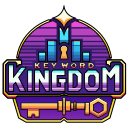

<!-- Improved compatibility of back to top link: See: https://github.com/othneildrew/Best-README-Template/pull/73 -->

<!-- PROJECT LOGO -->
 

  

<h3 align="center">Key Word Kingdom - A Word Guessing Game</h3>

  

This is a full-stack project created with Next.js that allows users to play a word guessing game. Progress and stats are saved to a PostgreSQL server and made visible to users on their profile.
     
     
    <a href="https://joshuarbarnhart.com/">View Demo(NYI)</a>
    ·
    <a href="https://github.com/jrbarnhart/key-word-kingdom/issues/new?labels=bug&template=bug-report---.md">Report Bug</a>
  

<!-- TABLE OF CONTENTS -->

  
Table of Contents

  <ol>
    <li>
      <a href="#about-the-project">About The Project</a>
      <ul>
        <li><a href="#built-with">Built With</a></li>
      </ul>
    </li>
    <li>
      <a href="#getting-started">Getting Started</a>
      <ul>
        <li><a href="#prerequisites">Prerequisites</a></li>
        <li><a href="#installation">Installation</a></li>
      </ul>
    </li>
    <li><a href="#license">License</a></li>
    <li><a href="#contact">Contact</a></li>
  </ol>

<!-- ABOUT THE PROJECT -->

## About The Projec

My goal with this project is to create a full-stack application using Next.js in order to learn the basics of the framework as well as React Server Components. I chose to create a game in order to tackle the problem of managing state across the client and server, and a word game specifically for the reduced creative media requirements.

## Game Basics

**Objective**: Guess the secret Key Word as quickly as you can.

**Gameplay**:

- A Key Word is chosen from a list of words.
- Players are presented with a set of unique characters from the Key Word.
- The length of the Key Word is shown as underscores.
- Players use the provided characters to guess words.
- Correct letter placements from guesses are revealed on the Key Word display.

(<a href="#readme-top">back to top</a>)

### Built With

- **Next.js - Full-stack React framework**
- **TailwindCSS - Utility class based style library**
- **Postgres & Prisma - SQL Database and ORM**
- **Shadcn UI - React component library**

(<a href="#readme-top">back to top</a>)

<!-- GETTING STARTED -->

## Getting Started

- Play the game live on my [Personal Portfolio (NYI)](https://www.joshuarbarnhart.com)

- Instructions for running locally will be added in the future.

(<a href="#readme-top">back to top</a>)

<!-- LICENSE -->

## License

Distributed under the MIT License. See `LICENSE` for more information.

(<a href="#readme-top">back to top</a>)

<!-- CONTACT -->

## Contact

[My Portfolio](https://joshuarbarnhart.com)

[LinkedIn](https://linkedin.com/in/joshuarbarnhart)

(<a href="#readme-top">back to top</a>)

